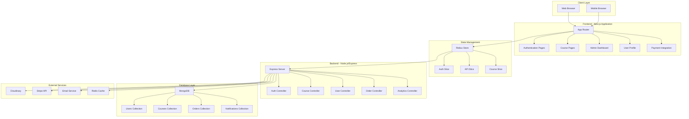
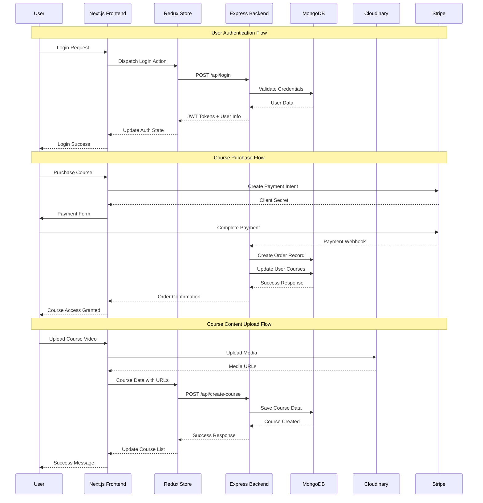
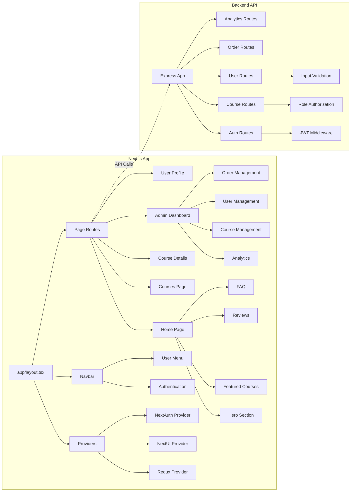

# 📚 Learning Corner - Online Learning Platform

A comprehensive online learning platform built with Next.js and Node.js, featuring modern web development practices and enterprise-level architecture for delivering high-quality educational content.

## 🔧 Tech Stack

### Frontend
[](https://reactjs.org/)
[](https://nextjs.org/)
[](https://www.typescriptlang.org/)
[](https://tailwindcss.com/)

### Backend
[](https://nodejs.org/)
[](https://expressjs.com/)
[](https://www.mongodb.com/)
[](https://jwt.io/)
[](https://redis.io/)
[](https://cloudinary.com/)

### Development Tools & Infrastructure
[](https://socket.io/)
[](https://stripe.com/)
[](https://nodemailer.com/)

## 🌟 Features

### 📖 Course Management
- **Comprehensive Course Catalog**: Create, search, update, and delete courses with rich metadata
- **Advanced Filtering & Search**: Search by title, category, level, and tags
- **Course Content Organization**: Structured video lessons with sections and chapters
- **Video Integration**: Seamless video player with progress tracking
- **Course Prerequisites**: Define learning paths with required prerequisites
- **Course Benefits**: Highlight what students will achieve

### 👥 User Management & Authentication
- **Secure Authentication**: JWT-based authentication with refresh tokens
- **Social Login**: Google and GitHub OAuth integration via NextAuth.js
- **Email Verification**: Account activation via email verification
- **Role-Based Access Control**: Student, instructor, and admin roles
- **User Profiles**: Comprehensive profile management with avatar upload
- **Password Security**: Encrypted password storage with bcrypt

### 🎓 Learning Experience
- **Interactive Course Player**: Rich video player with lesson navigation
- **Progress Tracking**: Real-time learning progress monitoring
- **Q&A System**: Students can ask questions and get answers
- **Course Reviews & Ratings**: 5-star rating system with detailed reviews
- **Certificate Generation**: Course completion certificates
- **Bookmarks & Notes**: Save important lessons and take notes

### 💳 Payment & Subscription
- **Stripe Integration**: Secure payment processing for course purchases
- **Multiple Payment Methods**: Support for cards, digital wallets
- **Order Management**: Complete order history and invoice generation
- **Subscription Plans**: Flexible pricing models
- **Coupon System**: Discount codes and promotional offers

### 📊 Analytics & Reporting
- **Admin Dashboard**: Comprehensive analytics dashboard
- **Course Analytics**: Student enrollment, completion rates, revenue tracking
- **User Analytics**: User engagement and activity metrics
- **Sales Reports**: Revenue tracking and financial analytics
- **Popular Courses**: Most enrolled and highest-rated courses
- **Interactive Charts**: Data visualization with Recharts

### 🔔 Communication System
- **Real-time Notifications**: Socket.io powered live notifications
- **Email Notifications**: Automated emails for course updates, Q&A responses
- **Discussion Forums**: Course-specific discussion boards
- **Instructor Messaging**: Direct communication between students and instructors

### 🎨 Modern User Interface
- **Responsive Design**: Mobile-first, responsive design for all devices
- **NextUI Components**: Modern, accessible UI components
- **Dark/Light Mode**: Theme switching with next-themes
- **Professional UI/UX**: Clean, intuitive interface design
- **Loading States**: Smooth loading indicators and skeleton screens
- **Error Handling**: Comprehensive error management with user-friendly messages

### 🛡️ Security & Performance
- **Data Protection**: Secure data handling with input validation
- **Rate Limiting**: API rate limiting to prevent abuse
- **CORS Configuration**: Secure cross-origin resource sharing
- **Redis Caching**: Performance optimization with Redis caching
- **Image Optimization**: Cloudinary integration for image management
- **Code Splitting**: Optimized bundle sizes with Next.js

## 🛠️ Technology Stack

### Frontend Architecture
- **Framework**: Next.js 14.0.2 with App Router
- **Language**: TypeScript for type safety
- **UI Library**: NextUI v2 with modern components
- **Styling**: Tailwind CSS for utility-first styling
- **State Management**: Redux Toolkit with RTK Query
- **Forms**: Formik with Yup validation
- **Authentication**: NextAuth.js for OAuth and session management
- **Charts**: Recharts for data visualization
- **Real-time**: Socket.io client for live updates

### Backend Architecture
- **Runtime**: Node.js with Express.js framework
- **Language**: TypeScript for better development experience
- **Database**: MongoDB with Mongoose ODM
- **Caching**: Redis for session management and performance
- **Authentication**: JWT tokens with refresh token rotation
- **File Upload**: Cloudinary for image and video management
- **Email Service**: Nodemailer with EJS templates
- **Real-time**: Socket.io for live notifications
- **Payment**: Stripe for secure payment processing
- **Validation**: Express validation middleware

### Development Tools
- **Package Manager**: npm for dependency management
- **Build Tools**: Next.js built-in bundling and optimization
- **Code Quality**: ESLint with TypeScript rules
- **Version Control**: Git for source code management
- **Environment**: Environment variables for configuration

## 🏗️ Architecture

### System Architecture Overview


### Data Flow Diagram


### Component Architecture


## 📊 Database Schema

### Core Collections
- **Users**: User profiles, authentication, and course enrollments
- **Courses**: Course content, metadata, and media references
- **Orders**: Payment records and course purchases
- **Notifications**: System notifications and user alerts
- **Layout**: Website configuration and hero content

### Key Relationships
- Users ↔ Courses (Many-to-Many through enrollments)
- Courses → Reviews (One-to-Many)
- Users → Orders (One-to-Many)
- Courses ↔ Questions/Answers (One-to-Many with nested replies)

## 🚀 Getting Started

### Prerequisites
- Node.js 18+ and npm
- MongoDB database
- Redis server
- Cloudinary account
- Stripe account (for payments)

### Environment Variables

Create `.env` files in both client and server directories:

**Server (.env):**
```env
NODE_ENV=development
PORT=8000
DB_URL=mongodb://localhost:27017/learning-corner
REDIS_URL=redis://localhost:6379

# JWT Secrets
ACTIVATION_SECRET=your_activation_secret
ACCESS_TOKEN=your_access_token_secret
REFRESH_TOKEN=your_refresh_token_secret

# Cloudinary
CLOUD_NAME=your_cloudinary_name
CLOUD_API_KEY=your_cloudinary_api_key
CLOUD_SECRET_KEY=your_cloudinary_secret

# Email Service
SMTP_HOST=smtp.gmail.com
SMTP_PORT=587
SMTP_SERVICE=gmail
SMTP_MAIL=your_email@gmail.com
SMTP_PASSWORD=your_app_password

# Stripe
STRIPE_PUBLISHABLE_KEY=pk_test_...
STRIPE_SECRET_KEY=sk_test_...
```

**Client (.env.local):**
```env
NEXT_PUBLIC_SERVER_URI=http://localhost:8000/api/v1/
NEXTAUTH_SECRET=your_nextauth_secret
NEXTAUTH_URL=http://localhost:3000

# OAuth Providers
GOOGLE_CLIENT_ID=your_google_client_id
GOOGLE_CLIENT_SECRET=your_google_client_secret
GITHUB_CLIENT_ID=your_github_client_id
GITHUB_CLIENT_SECRET=your_github_client_secret
```

### Installation & Setup

1. **Clone the repository**
   ```bash
   git clone https://github.com/bunchangon711/TTCS_LearningWeb
   cd learning-corner
   ```

2. **Install dependencies**
   ```bash
   # Install server dependencies
   cd server
   npm install
   
   # Install client dependencies
   cd ../client
   npm install
   ```

3. **Start the development servers**
   
   **Terminal 1 - Backend:**
   ```bash
   cd server
   npm run dev
   ```
   
   **Terminal 2 - Frontend:**
   ```bash
   cd client
   npm run dev
   ```

4. **Access the application**
   - Frontend: http://localhost:3000
   - Backend API: http://localhost:8000

### Production Deployment

1. **Build the applications**
   ```bash
   # Build server
   cd server
   npm run build
   
   # Build client
   cd ../client
   npm run build
   ```

2. **Start production servers**
   ```bash
   # Start server
   cd server
   npm start
   
   # Start client
   cd ../client
   npm start
   ```

## 📱 API Endpoints

### Authentication
- `POST /api/v1/registration` - User registration
- `POST /api/v1/activate-user` - Email verification
- `POST /api/v1/login` - User login
- `POST /api/v1/social-auth` - Social authentication
- `GET /api/v1/logout` - User logout
- `GET /api/v1/refresh` - Refresh access token

### Courses
- `GET /api/v1/get-all-courses` - Get all public courses
- `GET /api/v1/get-single-course/:id` - Get course details
- `POST /api/v1/create-course` - Create new course (Admin)
- `PUT /api/v1/edit-course/:id` - Update course (Admin)
- `DELETE /api/v1/delete-course/:id` - Delete course (Admin)
- `GET /api/v1/get-course-content/:id` - Get course content (Enrolled)

### Course Interactions
- `PUT /api/v1/add-question` - Add question to course content
- `PUT /api/v1/add-answer` - Answer a question
- `PUT /api/v1/add-review/:id` - Add course review
- `PUT /api/v1/add-reply-to-review` - Reply to review (Admin)

### User Management
- `GET /api/v1/me` - Get current user info
- `PUT /api/v1/update-user-info` - Update user profile
- `PUT /api/v1/update-user-password` - Change password
- `PUT /api/v1/update-user-avatar` - Update profile picture
- `GET /api/v1/get-all-users-admin` - Get all users (Admin)
- `PUT /api/v1/update-user-role-admin` - Update user role (Admin)

### Orders & Payments
- `POST /api/v1/create-order` - Create course order
- `GET /api/v1/get-all-orders-admin` - Get all orders (Admin)
- `POST /api/v1/payment` - Create payment intent
- `GET /api/v1/payment/stripepublishablekey` - Get Stripe public key

### Analytics
- `GET /api/v1/get-users-analytics-admin` - User analytics (Admin)
- `GET /api/v1/get-courses-analytics-admin` - Course analytics (Admin)
- `GET /api/v1/get-orders-analytics-admin` - Order analytics (Admin)

### Layout & Content
- `GET /api/v1/get-layout-admin/:type` - Get layout content
- `PUT /api/v1/edit-layout-admin` - Update layout content (Admin)

## 🔐 Security Features

- **JWT Authentication**: Secure token-based authentication with refresh tokens
- **Role-Based Access Control**: Granular permissions for students, instructors, and admins
- **Input Validation**: Comprehensive server-side validation using Yup schemas
- **Rate Limiting**: API rate limiting to prevent abuse and DDoS attacks
- **CORS Configuration**: Secure cross-origin resource sharing
- **Password Encryption**: bcrypt hashing for secure password storage
- **Environment Variables**: Sensitive data protection through environment configuration
- **Secure Headers**: Security headers for protection against common vulnerabilities

## 📈 Key Highlights

### Modern Web Development Practices
- **Server-Side Rendering**: Next.js App Router for optimal performance
- **Type Safety**: Full TypeScript implementation across frontend and backend
- **Component Architecture**: Reusable, modular React components
- **State Management**: Efficient state handling with Redux Toolkit
- **API Integration**: Type-safe API calls with RTK Query
- **Real-time Features**: Socket.io integration for live notifications

### Scalable Architecture
- **Microservice Ready**: Modular backend architecture
- **Database Optimization**: Efficient MongoDB queries with Mongoose
- **Caching Strategy**: Redis caching for improved performance
- **File Management**: Cloudinary CDN for optimized media delivery
- **Payment Processing**: Secure Stripe integration
- **Email System**: Automated email notifications with templates

### User Experience
- **Responsive Design**: Mobile-first, cross-device compatibility
- **Progressive Enhancement**: Graceful degradation for lower-end devices
- **Accessibility**: WCAG compliant components with NextUI
- **Performance Optimization**: Code splitting, lazy loading, and image optimization
- **SEO Friendly**: Server-side rendering and meta tag optimization


## 🤝 Contributing

1. Fork the repository
2. Create a feature branch (`git checkout -b feature/amazing-feature`)
3. Commit your changes (`git commit -m 'Add some amazing feature'`)
4. Push to the branch (`git push origin feature/amazing-feature`)
5. Open a Pull Request

---

⭐ **Star this repository if you found it helpful!**

Built with ❤️ using Next.js, Node.js, and modern web technologies.
